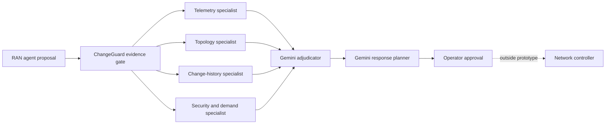

# ChangeGuard

**Evidence gate for autonomous telecom changes, powered by six live Gemini roles.**

Autonomous RAN agents can detect congestion and propose changes within seconds. Detection alone does
not justify changing a live network. ChangeGuard sits between a proposing agent and network
controller, independently testing whether each proposed change is supported, bounded, observable,
and reversible before an operator approves it.

> RAN agents propose changes. ChangeGuard decides whether those changes are safe and justified.

## Problem

A telecom change depends on evidence that should not be blended prematurely:

- telemetry proves whether degradation is real;
- topology constrains where traffic or capacity can move;
- change history tests whether another deployment caused symptoms;
- security and demand context distinguish attacks from legitimate load.

One generalist response can mix these sources, invent support, or overreach. ChangeGuard assigns each
domain to a source-isolated specialist, then makes evidence handoffs visible.

## End-to-end mission

1. RAN workflow submits incident evidence and proposed action.
2. Four Gemini specialists run concurrently, each receiving only its authorised source.
3. Gemini adjudicator receives specialist findings and selects supported root cause.
4. Gemini response planner returns bounded recommendation, success signals, stop conditions, and
   rollback triggers.
5. Operator reviews decision. Prototype never executes network change.

No preset verdict, expected-answer lookup, cached response, or controller fallback chooses result.
Schema, citation-scope, and resource-scope checks validate model output without deciding outcome.

## Demonstrated incident

Three cells near stadium sustain approximately 93% utilisation with rising packet loss. RAN agent
proposes temporary capacity reallocation. ChangeGuard independently checks:

| Evidence | Question answered |
|---|---|
| Telemetry | Is congestion current, sustained, and service-affecting? |
| Topology | Is proposed shift compatible with dependency and capacity limits? |
| Change history | Could recent deployment explain degradation instead? |
| Security / demand | Does traffic resemble attack or legitimate event demand? |

Supported outcome remains advisory: apply only within approved capacity boundary, observe defined
KPIs, stop on guardrail breach, and roll back when recovery conditions fail.

## Why six Gemini roles?

| Role | Evidence boundary | Responsibility |
|---|---|---|
| Telemetry specialist | Metrics only | Identify symptoms, trends, and candidate causes |
| Topology specialist | Topology only | Validate scope, dependencies, and movement limits |
| Change-history specialist | Deployment records only | Test temporal causality |
| Security/demand specialist | Threat and demand signals only | Separate hostile from legitimate load |
| Adjudicator | Four signed findings | Select root cause, confidence, and supporting citations |
| Response planner | Adjudicated result | Define safe action envelope and operator controls |

Specialists cannot see or alter each other's conclusions. Adjudicator waits for all findings.
Planner starts only after adjudication.

## Inspectability

Each mission records chronological evidence:

- role and evidence scope loaded;
- model call start, completion, latency, and token usage;
- full structured response and scoped citations;
- specialist-to-adjudicator and adjudicator-to-planner handoffs;
- final recommendation or explicit failure.

Credentials and hidden instructions stay excluded. Invalid schema, citation leakage, or model failure
stops mission; no canned answer silently replaces it.

## Safety boundary

- Incident records are locally modelled telecom scenarios.
- Reasoning outputs come from live Gemini calls during demo.
- Recommendation requires human approval.
- No production network, customer system, or controller is connected.
- ChangeGuard validates proposals; it does not diagnose instead of RAN agent or execute commands.

## Repository status

This cleaned submission repository intentionally contains documentation only:

- [README.md](README.md) — product story, mission, evidence, and trust boundary
- [architecture.md](architecture.md) — component model, contracts, sequencing, and failure semantics

Executable prototype source is not included in this documentation snapshot.

## Project

**ChangeGuard — Safety Gate for Autonomous Telecom Changes**

Built to demonstrate inspectable multi-agent judgment for telecom operations: isolated evidence,
visible handoffs, agent-owned decision, and honest advisory control.
