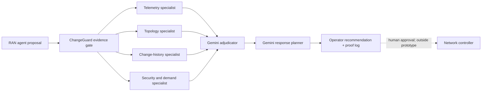

# ChangeGuard

**Evidence gate for autonomous telecom changes, powered by six live Gemini roles.**

[](https://github.com/JadeBear-09/codetrust-agent/actions/workflows/ci.yml)

Autonomous RAN agents can detect congestion and propose changes within seconds. Detection alone does
not justify changing a live network. ChangeGuard sits between a proposing agent and network
controller, independently testing whether each proposed change is supported, bounded, observable,
and reversible before an operator approves it.

> RAN agents propose changes. ChangeGuard decides whether those changes are safe and justified.

## How it works



Four source-isolated specialists run concurrently. Adjudicator receives only validated specialist
findings, then planner creates bounded response. Every handoff appears in chronological JSONL log.

See [architecture.md](architecture.md) for contracts, sequencing, trust boundaries, and failure
semantics.

## Decision guarantees

- Six live Gemini calls run for each mission.
- Each specialist sees only its authorised evidence source.
- Gemini owns findings, root-cause selection, confidence, and recommendation.
- Schema, citation-provenance, and resource-scope checks can reject output but never choose verdict.
- Model failure or provenance violation fails mission visibly; no canned fallback runs.
- Credentials and hidden system prompts never enter mission log.
- Recommendation remains advisory. Prototype has no production controller connection.

## Demonstrated RAN incident

Three stadium cells sustain high utilisation and packet loss. RAN workflow proposes temporary
capacity reallocation. ChangeGuard validates proposal against:

| Evidence domain | Question |
|---|---|
| Telemetry | Is congestion current, sustained, and service-affecting? |
| Topology | Is proposed shift compatible with dependency and capacity limits? |
| Change history | Could recent deployment explain degradation instead? |
| Security / demand | Does traffic resemble attack or legitimate event demand? |

Supported result still requires operator approval, success KPIs, observation window, stop conditions,
and rollback triggers.

## Repository layout

```text
app/                       Next.js operator console and API proxies
backend/src/tnoc/          Mission orchestration, validation, APIs, and safety controls
backend/prompts/           Versioned specialist, adjudicator, and planner instructions
backend/examples/          Local telecom incident and event fixtures
backend/tests/             Unit and safety regression tests
backend/deploy/            Docker, Helm, NetworkPolicy, and observability resources
docs/                      Operations, threat model, and proof notes
architecture.md            End-to-end architecture and decision contracts
```

## Requirements

- Node.js 22.13 or newer
- Python 3.12 or newer
- [uv](https://docs.astral.sh/uv/)
- Gemini API key for live mission

## Run locally

Clone and install:

```bash
git clone https://github.com/JadeBear-09/codetrust-agent.git
cd codetrust-agent
npm ci

cd backend
uv sync --extra dev --locked
cp .env.example .env
```

Set one backend-only key in ignored `backend/.env`:

```dotenv
GEMINI_API_KEY=replace_with_your_key
```

Start proof API from `backend/`:

```bash
uv run tnoc-proof-api
```

Start console from repository root in second terminal:

```bash
cp .env.example .env.local
npm run dev
```

Open [http://127.0.0.1:3000](http://127.0.0.1:3000), then launch live Gemini mission.

## Proof API

```text
GET  /v1/proof/config
POST /v1/proof/runs
GET  /v1/proof/runs/{run_id}
GET  /v1/proof/runs/{run_id}/log
GET  /v1/proof/runs/latest
```

Example mission request:

```json
{
  "mode": "live",
  "model": "gemini-3.1-flash-lite",
  "incident_id": "ran-capacity-congestion"
}
```

## Audit output

Each mission writes ignored runtime artifacts:

```text
outputs/agent-missions/<run-id>/run.jsonl
outputs/agent-missions/<run-id>/summary.json
outputs/agent-missions/<run-id>/report.md
```

`run.jsonl` records evidence scope, model-call receipts, structured responses, citations, timing,
token usage, final adjudication, and final recommendation. Secrets remain excluded.

## Verification

```bash
npm run lint
npm test

cd backend
uv run ruff check src tests
uv run mypy src
uv run pytest
```

CI runs same checks on every push and pull request.

## Security and limitations

- Incident records are modelled local fixtures, not subscriber or production network data.
- Never commit `.env`, generated outputs, credentials, controller URLs, or private telemetry.
- No RF equipment, customer system, or production controller is connected.
- ChangeGuard independently validates RAN proposal; it does not execute network command.

Read [SECURITY.md](SECURITY.md) and [docs/threat-model.md](docs/threat-model.md) before connecting new
evidence sources or tools.
