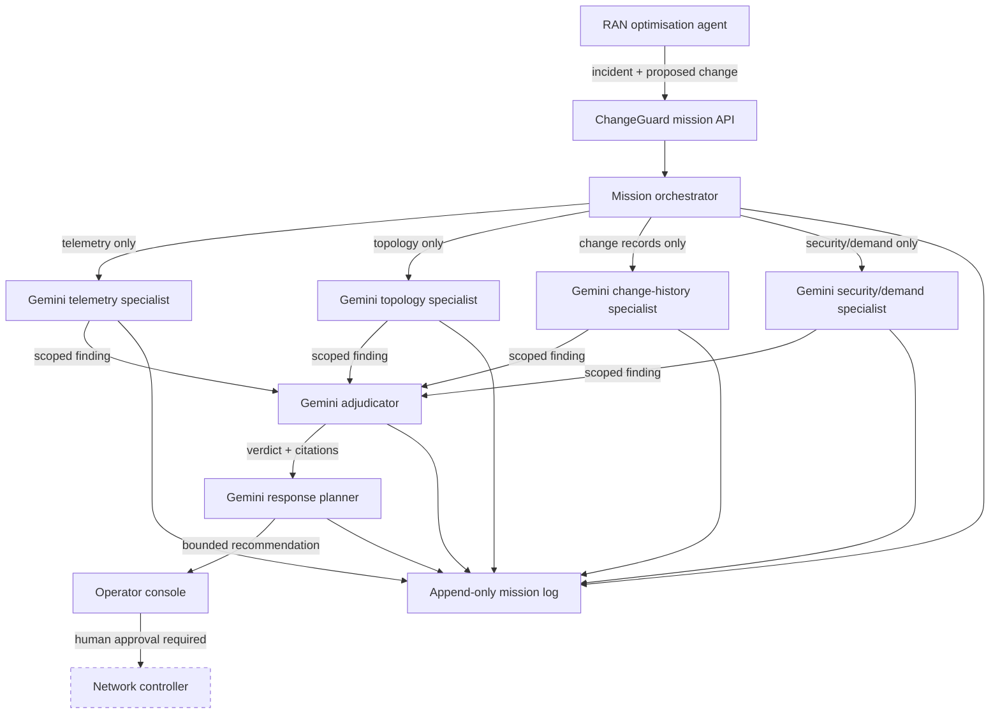

# ChangeGuard architecture

## 1. Purpose

ChangeGuard validates a network change proposed by an autonomous RAN workflow. It answers four
questions before recommendation reaches operator:

1. Is claimed condition supported by current evidence?
2. Is proposed action compatible with network constraints?
3. Is action bounded, measurable, and reversible?
4. What evidence or control would require block, review, stop, or rollback?

System is advisory. Controller execution remains outside prototype.

## 2. System context



Dashed controller boundary means designed integration point, not connected demo capability.

## 3. Decision ownership

Live Gemini outputs own:

- specialist findings and confidence;
- root-cause selection;
- adjudicated confidence and citations;
- final recommendation, success signals, stop conditions, and rollback triggers.

Application owns:

- orchestration order and concurrency;
- evidence isolation;
- schema validation;
- citation provenance checks;
- resource-scope enforcement;
- durable, chronological logging.

Validation code may reject output. It must never manufacture or substitute verdict.

## 4. Agent contracts

### Specialist input

| Field | Meaning |
|---|---|
| `mission_id` | Unique trace identifier |
| `incident_id` | Stable incident reference |
| `proposal` | RAN agent's requested change and claimed reason |
| `evidence` | Role-authorised evidence only |
| `allowed_citations` | Identifiers specialist may cite |

### Specialist output

| Field | Meaning |
|---|---|
| `finding` | Evidence-grounded conclusion |
| `candidate_causes` | Ranked explanations supported by source |
| `confidence` | Calibrated value with uncertainty |
| `citations` | Source-local evidence identifiers |
| `constraints` | Limits relevant to proposed action |

### Adjudicator output

Adjudicator receives findings—not unrestricted raw sources—and returns supported root cause,
confidence, cross-source citations, contradictions, missing evidence, and planning eligibility.

### Planner output

Planner returns recommendation status, approved action envelope, operator approval requirement,
success KPIs, observation window, stop conditions, and exact rollback triggers.

## 5. Mission sequence

```mermaid
sequenceDiagram
    actor O as Operator
    participant U as Console
    participant M as Orchestrator
    participant S as 4 Specialists
    participant A as Adjudicator
    participant P as Planner
    participant L as Mission Log

    O->>U: Launch validation
    U->>M: Incident + RAN proposal
    M->>L: mission_started
    par source-isolated live calls
        M->>S: Telemetry evidence
    and
        M->>S: Topology evidence
    and
        M->>S: Change-history evidence
    and
        M->>S: Security/demand evidence
    end
    S-->>M: Structured findings
    M->>L: agent_responded × 4
    M->>A: Four validated findings
    A-->>M: Root-cause verdict
    M->>L: adjudication_completed
    M->>P: Verdict + findings + proposal
    P-->>M: Bounded response
    M->>L: mission_completed
    M-->>U: Recommendation + proof trail
    U-->>O: Review; no automatic execution
```

## 6. Evidence isolation

Each source receives separate access token or scoped credential. Orchestrator maps role to one source.
Specialist prompt includes allowed citation set. Output validator rejects citation outside set.
Adjudicator citations must resolve to submitted specialist findings. Planner targets must remain
inside incident resource scope.

This design reduces source mixing, prompt overreach, and unsupported confidence while retaining
model-owned judgment.

## 7. Failure semantics

| Condition | Result |
|---|---|
| Source unavailable or stale | Mission fails or requests more evidence |
| Gemini call fails or times out | Mission fails visibly |
| Output violates schema | Response rejected; no fallback verdict |
| Specialist cites unauthorised source | Mission fails provenance check |
| Findings conflict materially | Adjudicator blocks or requests operator review |
| Planner exceeds resource scope | Recommendation rejected |
| Success KPI misses threshold | Stop and evaluate rollback |
| Rollback trigger fires | Operator receives explicit rollback instruction |

Fail-closed behavior applies to recommendation generation. Existing network state remains unchanged.

## 8. Audit model

Append-only JSONL event stream preserves:

1. `mission_started`
2. `agent_context_loaded`
3. `model_call_started`
4. `model_call_completed` or `model_call_failed`
5. `agent_responded`
6. `adjudication_completed`
7. `recommendation_completed`
8. `mission_completed` or `mission_failed`

Events include role, source scope, timestamps, latency, model identifier, token usage, structured
output, and citation metadata. API keys, bearer tokens, and hidden system prompts are excluded.

## 9. Security and privacy

- Secrets remain environment-injected and never logged.
- Least-privilege source scopes limit each specialist.
- Inputs and outputs receive schema and size validation.
- Correlation IDs connect UI, API, model receipt, and audit event.
- Mutating controller capability is absent from prototype.
- Human approval stays explicit and externally enforceable.

## 10. Demonstrated RAN decision

| Stage | Evidence-backed result |
|---|---|
| Proposal | Temporarily reallocate capacity across three congested stadium cells |
| Telemetry | Sustained high utilisation and packet loss |
| Topology | Traffic shift constrained to bounded percentage |
| Change history | No recent deployment explains incident |
| Security/demand | Pattern consistent with legitimate event demand |
| Adjudication | Capacity congestion supported across isolated findings |
| Planning | Bounded change, KPI watch, stop conditions, rollback, human approval |

ChangeGuard output is decision package, not network command.
